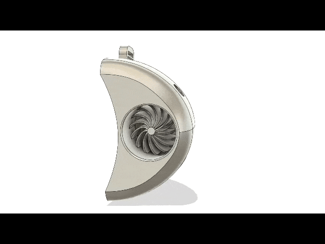
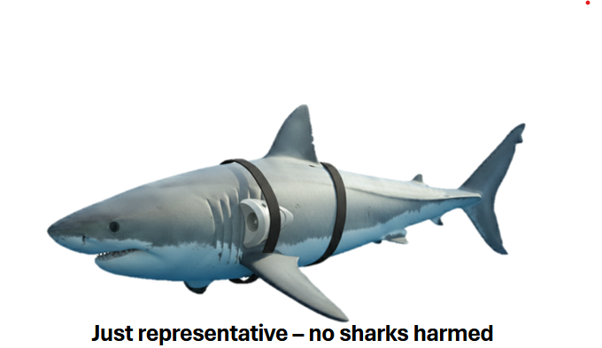
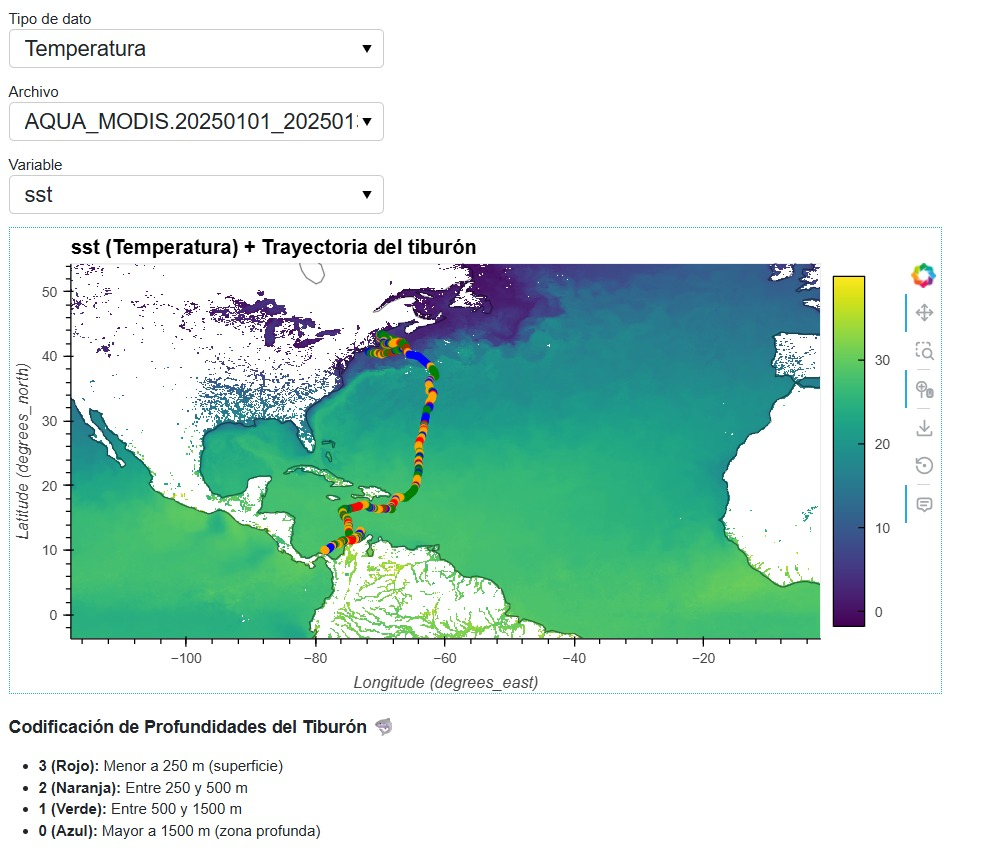

# <h1 align="left">🦈 Shark Tracker  </h1>
Predicting Shark Foraging Habitats with NASA Data 🌊

<div align="center">
  
</div>

## 🔍 Project

**Shark Tracker** is an innovative project combining **smart tracking devices**, **NASA satellite data**, and **mathematical models** to predict shark foraging habitats and track their movements in real-time.

This project aims to **better understand sharks**, their foraging patterns, and contribute to **marine ecosystem conservation**.

> Note: The models of the Shark Tracker can be found in the `models` folder.
 
---

## 🛠 Project Features

* **📡 Shark Tracking Device**

  * Attached to the side of the shark.
  * Generates energy using the shark's natural movement.
  * Sends **real-time location data**.

* **📊 Prediction Algorithm**

  * Uses **shark location data** and **NASA satellite data** (sea surface temperature and phytoplankton).
  * Predicts the **shark's trajectory and foraging habitats**.

* **🌐 Visualization Algorithm**

  * Generates interactive maps and graphs of shark activity.

---

## 🎯 Objectives

1. Identify **shark foraging hotspots**.
2. Quantify the relationship between:

   * Oceanographic features 🌊
   * Phytoplankton communities 🌱
   * Predator movement 🦈
3. Develop a **conceptual smart tag model** to measure diet and location in real-time.

---

## 🧩 How It Works

1. **The device** attaches to the shark and collects position and movement data.
2. **The mathematical algorithm** receives both device and NASA satellite data.
3. **The predictive model** estimates likely shark trajectories and foraging zones.
4. **The visualization module** creates interactive maps and graphs.
<div align="center">
  
</div>

---

## 📦 Technologies Used

* **Python** 🐍
* **Pandas / NumPy** for data processing
* **Matplotlib / Seaborn / Plotly** for visualization
* **NASA APIs (PACE & SWOT)** for satellite data
* **Custom IoT device** for shark tracking

---

## 🚀 How to Run the Project

To use this project, you need to:

1. Download sea surface temperature (SST) and chlorophyll concentration data using NASA's OB.DAAC Level 3 & 4 Browser: https://oceandata.sci.gsfc.nasa.gov/l3/
Prepare shark location data in CSV format (id, lat, lon) obtained from the tracker or generated synthetically for testing.

2. Then, clone this repository:

```bash
git clone https://github.com/your-username/shark-tracker.git
```

3. Install dependencies:

```bash
pip install -r requirements.txt
```

4. Move your .nc files of temperature to a folder and the .nc files of chlorophyle to another one and run the program to convert the data to scv file (modify the code of the programs with your .nc folder path):

```bash
python temp_convertir_nc_a_csv.py
```

```bash
python chloro_convertir_nc_a_csv.py
```

5. Merge the two .csv files :

```bash
python creacion_archivos.py
```

6. Create and train your machine learning model:
   
```bash
python modelo.py
```

7. Test the model:
   
```bash
python prediccion.py
```
---

## 🌟 Results

* Global maps of **shark activity**
* Identification of **foraging hotspots**
* Visualization of the relationship between **phytoplankton and sharks**

Map of sharks localization with our vizualizer

<div align="center">
  
</div>

---

## 📚 References

* NASA PACE Mission: [https://pace.gsfc.nasa.gov/](https://pace.gsfc.nasa.gov/)
* NASA OB.DAAC Level 3 & 4 Data Browser: [https://oceandata.sci.gsfc.nasa.gov/l3/](https://oceandata.sci.gsfc.nasa.gov/l3/)
* DataOne Repository (Chlorophyll and SST datasets): [https://search.dataone.org/view/10.24431/rw1k329](https://search.dataone.org/view/10.24431/rw1k329)

---

## 🦈 Contact
Sebastian Benitez​ - [sfbenite@espol.edu.ec](mailto:@espol.edu.ec)

Abel López Macías​ - [ailopez@espol.edu.ec](mailto:@espol.edu.ec)

Sebastian Mites​ - [dmites@espol.edu.ec](mailto:@espol.edu.ec)

Sophia Eras Aspiazu​ - [speras@espol.edu.ec](mailto:@espol.edu.ec)

William Mayorga - [wilimayo@espol.edu.ec](mailto:wilimayo@espol.edu.ec)
